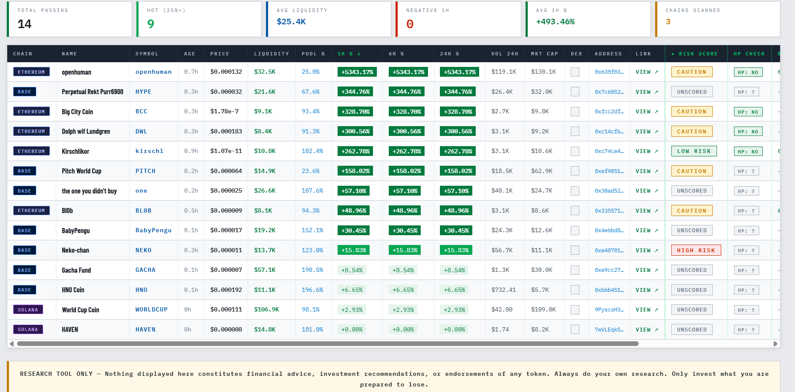
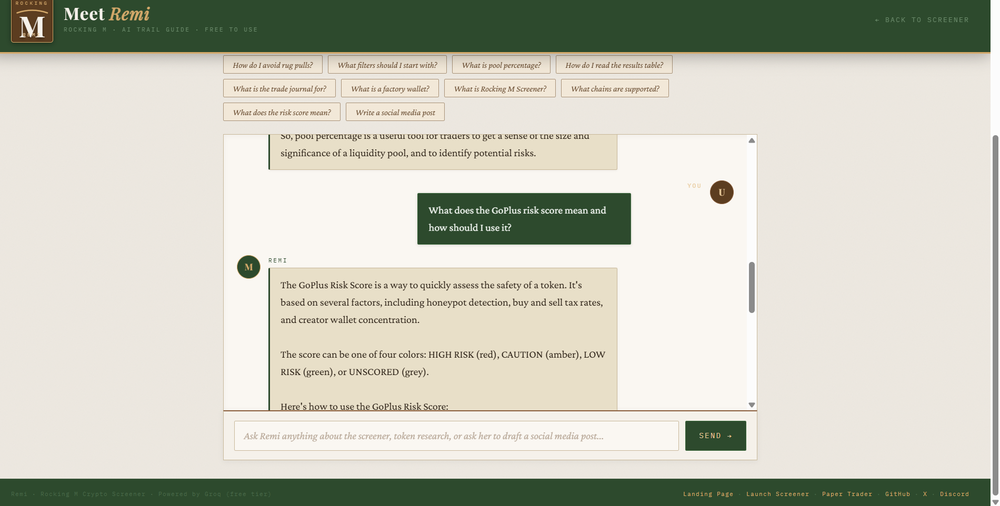
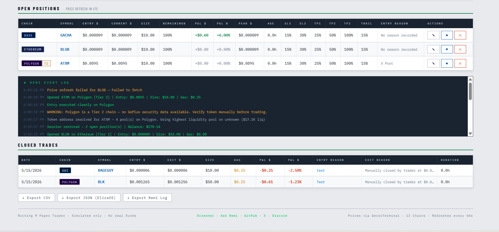

# 🏔️ Rocking M Crypto Screener

**Open source multi-chain crypto screener built by a leather craftsman from Montana.**
> *You don't have to be a master trader. You just need to know how to use the tools.*

**No paywalls. No signups. No influencer noise.** Just honest, filterable on-chain data you control.

**[🚀 Launch the Screener](https://rockingmscreener.com/screener.html)**  
**[📊 Paper Trader](https://rockingmscreener.com/papertrader.html)** · **[🤖 Remi AI](https://rockingmscreener.com/remi.html)**  
**[@Rockingmscreen on X](https://x.com/Rockingmscreen)** · **[Discord](https://discord.gg/aumVpSavB)**

---

## Why Rocking M?

I'm Edward, a small-town handyman and leather craftsman from Montana. I got tired of complicated or paywalled trading tools built for whales, not regular people. So I built something better — a completely free, no-BS crypto screener that runs right in your browser.

The Rocking M brand comes from my leather work. The inverted rocker in the logo represents taking old-school craftsmanship (patience, honesty, quality) into modern technology. Same philosophy: do the work right, or don't do it at all.

---

## What It Does

The Rocking M Screener scans new liquidity pools across multiple blockchains using **GeckoTerminal's free API**. You can scan up to **5 chains simultaneously**, with support for a total of **13 blockchains**. You set the filters — minimum liquidity, max pool age, volume, price movement — and the screener returns what matches. For Tier 1 chains, every result is automatically checked for security red flags using GoPlus, then ranked by a composite score that weighs momentum, liquidity, freshness, and volume together.

Think of it as a fishing net with adjustable mesh: cast it where you want, tune the holes, and see what swims up.

### Key Features

- **Multi-chain scanning** — Select up to 5 chains at a time
- **Tier 1 + Tier 2 chains** with clear security differences marked
- **GoPlus Security scanning** (Tier 1 only) — automatic honeypot, tax, holder, and creator concentration checks with composite risk scoring
- **Composite Pool Score** — weighted ranking (momentum 40%, liquidity 25%, freshness 20%, volume 15%) so the best overall opportunities surface first
- **Remi** — your plain-spoken AI trail guide (powered by Groq Llama 3.1)
- **Paper Trader** — realistic simulated trading with stop-loss, take-profit, trailing stops, and liquidity alerts
- **Trade Journal** + CSV/JSON export (ElizaOS compatible)
- **Auto-refresh** and one-click GeckoTerminal links
- **100% client-side** — no backend, no tracking, no accounts

---

## Supported Chains

**Tier 1 — Full GoPlus Security Scanning**  
Solana, Ethereum, Base, BSC, Arbitrum, Optimism

**Tier 2 — Price & Liquidity Data Only**  
Polygon, Avalanche, Sui, Tron, Blast, Berachain, Cosmos

> **Note:** Always do extra research on Tier 2 tokens since GoPlus security data is not available.

---

## GoPlus Security & Risk Scoring

For Tier 1 chains, the screener automatically checks every token after each scan:

- **Honeypot detection** — can the token actually be sold
- **Buy and sell tax percentages** — how much you'll lose on entry/exit
- **Holder count** — is the supply spread out or concentrated?
- **Creator wallet concentration** — high % means the dev can dump at any time

### Risk Score Meaning

| Score | Meaning |
|---|---|
| 🔴 **HIGH RISK** | Honeypot confirmed, sell tax over 10%, or creator holds over 50% of supply |
| 🟡 **CAUTION** | Sell/buy tax 5–10%, creator holds 20–50%, or under 10 holders |
| 🟢 **LOW RISK** | Passed all checks with sufficient data |
| ⬜ **UNSCORED** | Too new for GoPlus to have enough data — not a clean bill of health |

**Important:** The HP Check column shows the honeypot result only. HP: NO means the sell function works mechanically — it does not mean the token is safe. A token can show HP: NO and still be rugpulled through liquidity pairs, creator dumps, or contract exploits. **Always verify contract code on Etherscan/Solscan before trading real money.**

---

## Composite Pool Score

After each scan, every token receives a 0–100 composite score used for the default sort order:

| Signal | Weight | Cap |
|---|---|---|
| 1H Momentum | 40% | 200% gain |
| Liquidity | 25% | $100K |
| Freshness (pool age) | 20% | 24h window |
| Volume 24H | 15% | $500K |

Newer, liquid, actively-traded tokens showing strong 1H momentum rank at the top. You can still sort by any individual column — Score is just the default starting view. The Score column is visible in the table and sortable.

---

## Meet Remi & the Paper Trader

**[Remi AI](https://rockingmscreener.com/remi.html)** — Your plain-spoken, no-hype trail guide. Remi helps you:

- Understand what each filter does and why
- Spot rug pull patterns and scam tactics
- Interpret GoPlus security results
- Learn how to read on-chain data without drinking the Kool-Aid

Ask Remi anything about the screener or crypto trading fundamentals. Powered by Groq's Llama 3.1 (requires a free API key from console.groq.com).

**[Paper Trader](https://rockingmscreener.com/papertrader.html)** — Simulate trades using real market data across all 13 chains with no real money at risk. Features:

- Tiered stop loss and take profit levels
- Trailing stops
- Automated level tracking
- Liquidity collapse detection
- Trade outcomes exported in ElizaOS format for agent training

---

## Screenshots

*Five Tier 1 chains — GoPlus Risk Score, HP Check, Composite Score column, and security data visible*

*Remi answering a question about the GoPlus risk scoring system*

*Paper Trader with open positions, automated level tracking, and Remi event log*

---

## Quick Start

No installation required. Open in any modern browser.

1. **Visit** [rockingmscreener.com](https://rockingmscreener.com) or open `screener.html` locally
2. **Select chains** — up to 5 at a time. GoPlus security scoring only runs on Tier 1 results. Tier 2 returns price and liquidity data only.
3. **Adjust filters** or leave the presets as they are:
   - **Min Liquidity** — filters out dust, focuses on established pools
   - **Max Pool Age** — finds newly created pools (lower = newer)
   - **Min 1H Change** — targets fast movers or steady climbers
   - **Min Volume 24H** — confirms real trading activity
4. **Click RUN SCAN** — screener queries GeckoTerminal
5. **Results are ranked by Composite Score** — best overall opportunities first. GoPlus data loads automatically for all Tier 1 results.

---

## The Filters Explained

| Filter | What It Does |
|---|---|
| **Min Liquidity** | Weeds out low-value noise. Higher values return more established pools. $5K finds gems; $100K finds safer plays. |
| **Max Pool Age** | Keeps results aligned to new pool discovery. Lower values (e.g., 7 days) find brand-new pools. Higher (30+ days) finds more established tokens. |
| **Min 1H Change** | Set higher (e.g., +50%) for fast movers and potential day trades. Set lower (0%–20%) for slow steady climbs. |
| **Min Volume 24H** | Confirms trading activity behind the price movement. No volume = nobody's interested. |

---

## Trade Journal

The optional trade journal logs what you traded and why — token, contract address, entry price, exit price, and your reason for the trade. No dollar amounts are ever collected or requested.

Journal data exports as **JSON in a format designed for ElizaOS agent training** — building a dataset of real trade decisions and outcomes over time so AI agents can learn your strategy.

---

## Tech Stack

- **Vanilla HTML, CSS & JavaScript** — no frameworks, no dependencies, no bloat
- **GeckoTerminal free API** — no key required for screener
- **GoPlus Security API** — no key required, Tier 1 chains only
- **Groq free API** — key required for Remi (free at console.groq.com)

**Runs entirely in the browser** — no server, no backend, no tracking, no data collection.

---

## Code Architecture (screener.html)

The screener JavaScript is organized into focused modules, each with a clear responsibility:

| Module | Functions | Purpose |
|---|---|---|
| **Filter Module** | `getFilterConfig()`, `applyFilters()` | Reads UI values; tests each token against active filters |
| **Scoring Module** | `scorePool()`, `calcRiskScore()` | Composite pool ranking; GoPlus risk verdict |
| **Fetch Module** | `fetchGecko()`, `fetchGoPlus()` | GeckoTerminal and GoPlus API calls |
| **Render Module** | `updateTableHeaders()`, `getChainTag()`, `renderGpCells()`, `renderTable()`, `updateStats()` | All DOM output |

This modular structure prepares the codebase for Phase 2 — the master dashboard and `agent-core.js` decision engine can call these functions directly without touching unrelated code.

---

## Roadmap

- ✅ Multi-chain screener (13 chains, max 5 per scan)
- ✅ GoPlus Security integration — honeypot detection, tax analysis, holder concentration, composite risk scoring
- ✅ Remi — AI trail guide powered by Groq
- ✅ Paper Trader — tiered SL/TP, trailing stops, liquidity detection, ElizaOS export
- ✅ Trade Journal with CSV + JSON export
- ✅ AI Trader Phase 1 — autonomous paper trader (experimental)
- ✅ AI Trader Phase 1.5 — real DexScreener price tracking
- ✅ **Screener refactor** — modular filter, scoring, and render architecture (v1.6)
- ⬜ **Leaderboard** — community paper trader leaderboard (built, launching June 1)
- ⬜ **Paper Trader refactor** — extract entry/exit logic, risk calculations, export functions
- ⬜ **AI Trader refactor** — extract safety scoring, position/exit logic
- ⬜ **Mobile optimization** — full responsive layout across all tools
- ⬜ **Master Dashboard** — unified view of both portfolios with combined performance metrics
- ⬜ **Profit allocation engine** — rules-based routing of gains to preservation/yield buckets
- ⬜ **Smart money tracking** *(research ongoing — no free-tier solution identified yet)*
- ⬜ **ElizaOS agent integration** — autonomous trading powered by Rocking M signals and real trade history

---

## Contributing

This project grows through honest community input. You are welcome to:

- **Share filter presets** that have worked for you
- **Contribute trade journal insights and outcomes** — help us understand what works
- **Suggest new chains or features** — open an Issue
- **Report bugs or improvements** — GitHub Issues (no coding required)
- **Spread the word** — to traders who would benefit from honest tools

**[See CONTRIBUTING.md](https://github.com/RockingMScreener/rocking-m-screener/blob/main/CONTRIBUTING.md) for details.** No coding experience required — real trader feedback is extremely valuable.

**Developers:** The entire stack is vanilla HTML/CSS/JavaScript with no build process. Clone the repo, open `screener.html` in your browser, and start hacking. We welcome PRs for bug fixes, new chains, optimizations, and features.

---

## License

MIT License — free to use, modify, and share. See [LICENSE](https://github.com/RockingMScreener/rocking-m-screener/blob/main/LICENSE) file for details.

---

## Support

- **Questions?** Start a [Discussion](https://github.com/RockingMScreener/rocking-m-screener/discussions)
- **Found a bug?** [Open an Issue](https://github.com/RockingMScreener/rocking-m-screener/issues)
- **Want to chat?** Join us on [Discord](https://discord.gg/aumVpSavB) or follow [@Rockingmscreen](https://x.com/Rockingmscreen) on X

---

**Made in Montana with patience, real-world trading frustration, and AI assistance.**

Thank you for checking out Rocking M. I hope it helps you swing the hammer a little straighter.

— Edward  
*Rocking M Leather Works · Montana*
